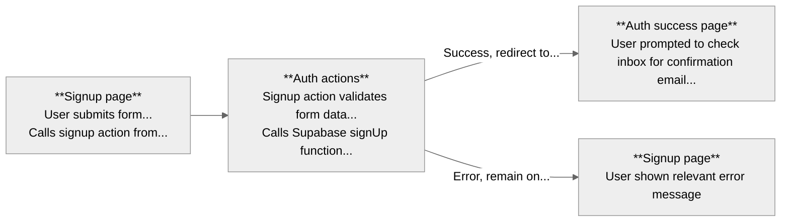
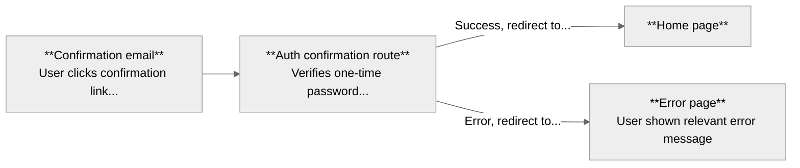
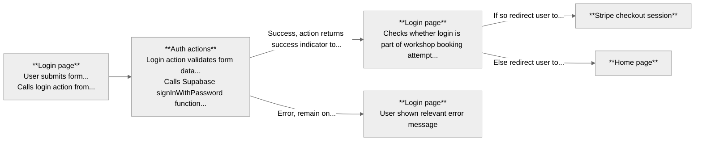
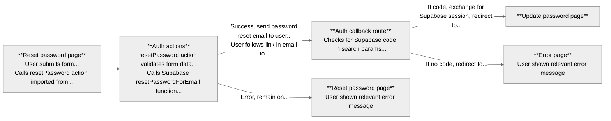
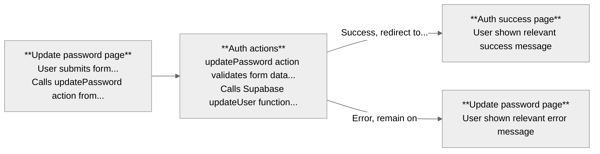
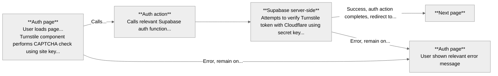
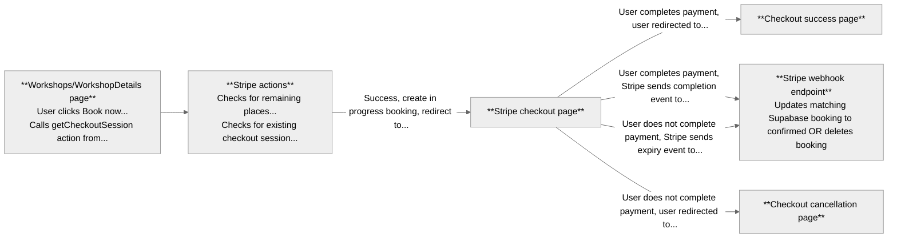

# Fuzzy Logic

## Overview

This is the booking platform for [Fuzzy Logic](https://www.fzzy.co.uk), an improv company I founded. I built it when I wanted to run a workshop, and took the opportunity to stretch my full stack development skills instead of using a third-party ticketing service.

The site:

- Displays upcoming workshops
- Handles user account registration and authentication
- Processes payments
- Updates bookings after payment
- Shows upcoming bookings in user accounts

It uses:

- Next.js + TypeScript (front-end + back-end)
- Tailwind (styling)
- Supabase (database and auth)
- Cloudflare Turnstile (CAPTCHA)
- Stripe (payments)
- Husky (Git hooks)
- Jest + React Testing Library (unit testing)
- Manual testing checklist (critical data flows)
- Vercel (deployment)

## Development process

I initially designed and developed the fully functional site in just under three months. This version launched in May 2025, and successfully processed £000s in user payments.

The codebase, however, was less polished than I wanted; code was repeated. I therefore revisited the project a few months later and refactored the site. This included:

### Organisation

- Dividing several pages (e.g. `/workshops`, `/account`) into server components for data fetching, and client wrappers for rendering
- Splitting large components (such as the navbar) into modular components
- Breaking large functions into smaller functions with single responsibilities (e.g. Stripe `getCheckoutSession` action)
- Extracting repeated logic to separate functions or hooks (e.g. `usePasswordStrength` hook, Supabase error handling in auth actions)
- Organising `/app` using route groups
- Dividing `/components` into subdirectories
- Moving all actions and hooks into dedicated folders in `/src`

### Styling

- Moving most styling from `globals.css` into component files, including creating a design system of UI components to ensure consistency across common elements (Text, Button, ListItem, etc.)

### TypeScript

- Extracting TypeScript interface definitions (e.g. Workshop, Booking, Student) to separate files and importing them where needed, to prevent inconsistencies created by defining types ad hoc within components
- Adding Database type generated by Supabase CLI to Supabase createClient functions
- Creating util functions to consistently convert raw data from Supabase into more convenient format, and adding types for the resulting data
- Adding return types to most functions definitions (apart from very short functions where this is obvious)

### Validation

- Apply consistent backend form validation using Zod

### Developer experience

- Adding automated pre-commit linting and testing via Husky to ensure code quality
- Enforcing conventional commits with commitlint

I found the resulting site much easier to understand and maintain, with the code being more readable, and the flow of data through the app much more understandable.

### Next steps

The next steps are mostly around testing. Currently, while some tests (such as those for AuthContext and auth-related pages) check important data flows, overall testing focusses too heavily on component rendering, with insufficient coverage of logic. Mocking is also handled inconsistently across the tests, and integration testing is handled manually. I am currently improving my understanding of best practices around testing, and plan to add new tests and refactor existing ones to address these issues over the next few months.

## How it works

Some documentation on how data flows in the app, for my benefit in maintaining the project as much as yours in reading about it 🙃.

### Supabase data fetching

The site fetches data from Supabase using the three clients in `/utils/supabase`:

- **admin.ts:** Uses createClient function with secret key, for backend admin
  - Used by Stripe webhook
- **browserClient.ts:** Uses createBrowserClient function with publishable key, for data fetching in client components
  - Used by auth context
- **serverClient.ts:** Uses createServerClient function with publishable key, for data fetching in server components
  - Used by:
    - About, Account, Workshops, and WorkshopDetails pages
    - `/auth/confirm` and `/auth/callback` routes
    - Mailing list, Stripe, and auth actions
    - Supabase `updateSession` middleware function

### Auth data flows

Authentication forms call actions from `/actions/auth`, which in turn call the relevant Supabase auth function:

#### Signup

#### Signup email confirmation

#### Login

#### Reset

#### Update

### Turnstile CAPTCHA verification

The signup, login, and reset password pages use Cloudflare Turnstile to perform CAPTCHA checks.

The Turnstile component rendered on each of these pages accesses the site key as an environment variable. When the user passes CAPTCHA, this component generates a token which is submitted along with the form data.

When the form is submitted and the relevant auth action called, this token is passed to the corresponding Supabase auth function. This function verifies the token with the Cloudflare Siteverify API, using the Cloudflare secret key stored as an environment variable on Supabase.

### Auth context

The `/contexts/AuthContext` file exports a context provider component (`AuthContext`), and a `useAuth` function, which returns a `user`, and `isLoggedIn` and `isLoading` boolean variables. Other files which need to use the `AuthContext` call the `useAuth` function.

This context is used by the update page, and the Layout, global-error, and Header components, and the `useWorkshopCheckout` hook.

### Stripe data flows

Stripe sessions are created from the Workshops or WorkshopDetails pages by calling the `getCheckoutSession` action from `/actions/stripe`. This begins a Stripe checkout session, passes on success and cancellation URLs, and creates a new "in progress" workshop booking in Supabase.

On completion or expiration of the checkout session, Stripe sends the corresponding event to the `/api/webhooks/stripe` endpoint, which updates the matching booking in Supabase accordingly.

