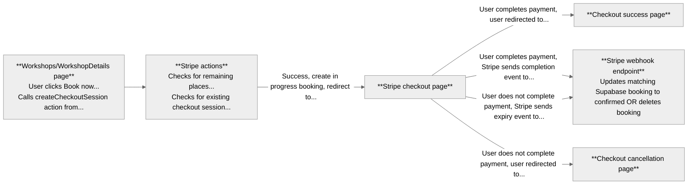

# Fuzzy Logic

## Overview

This is the booking platform for [Fuzzy Logic](https://www.fzzy.co.uk), an improv company I founded. I built it when I wanted to run a workshop, and took the opportunity to stretch my full stack development skills instead of using a third-party ticketing service.

### What it does

- Displays upcoming workshops
- Handles user account registration and authentication
- Processes payments through Stripe
- Shows upcoming bookings in user accounts

### Tech stack

- Next.js + TypeScript (front-end + back-end)
- Tailwind (styling)
- Supabase (database and auth)
- Cloudflare Turnstile (CAPTCHA)
- Stripe (payments)
- Jest (unit testing)
- Manual testing checklist for critical flows
- Vercel (deployment)

After initial development the site was fully functional, but the codebase was less coherent than I wanted, and I found it difficult to navigate and maintain. I therefore revisited the project a few months later and refactored parts of the site, including organising `/app` using route groups, dividing `/components` into subdirectories, and separating all actions and hooks into dedicated folders. I also split several pages into server components for data fetching, and client wrappers for rendering, to make them easier to maintain and test. At the same time, I added Husky to ensure code quality with automated pre-commit linting and testing.

I plan to continue refactoring the site, including standardising my approach to mocking across test suites, and applying design patterns where relevant.

## Data

Some documentation on how data flows in the app, for my benefit in maintaining the project as much as yours in reading about it 🙃.

### Supabase data fetching

The site fetches data from Supabase using the three clients in /utils/supabase:

- **admin.ts:** Uses createClient function with secret key, for backend admin
  - Used by Stripe webhook
- **browserClient.ts:** Uses createBrowserClient function with publishable key, for data fetching in client components
  - Used by auth context
- **serverClient.ts:** Uses createServerClient function with publishable key, for data fetching in server components
  - Used by:
    - About, Account, Workshops, and WorkshopDetails pages
    - `/auth/confirm` and `/auth/callback` routes
    - Mailing list, Stripe, and auth actions
    - Supabase updateSession middleware function

### Auth data flows

Authentication forms call actions from `/actions/auth`, which in turn call the relevant Supabase auth function:

#### Signup

#### Signup email confirmation

#### Login

#### Reset

#### Update

### Turnstile CAPTCHA verification

The signup, login, and reset password pages use Cloudflare Turnstile to perform CAPTCHA checks.

The Turnstile component rendered on each of these pages accesses the site key as an environment variable. When the user passes CAPTCHA, this component generates a token which is submitted along with the form data.

When the form is submitted and the relevant auth action called, this token is passed to the corresponding Supabase auth function. This function verifies the token with the Cloudflare Siteverify API, using the Cloudflare secret key stored as a Supabase environment variable.

### Auth context

The `/contexts/AuthContext` file exports a context provider component (`AuthContext`), and a `useAuth` function, which returns a `user`, and `isLoggedIn` and `isLoading` boolean variables. Other files which need to use the `AuthContext` call the `useAuth` function.

This context is used by the Header component.

### Stripe data flows

Stripe sessions are created from the Workshops or WorkshopDetails pages by calling the createCheckoutSession action from `/actions/stripe`. This begins a Stripe checkout session, passes on success and cancellation URLs, and creates a new "in progress" workshop booking in Supabase.

On completion or expiration of the checkout session, Stripe sends the corresponding event to the `/api/webhooks/stripe` endpoint, which updates the matching booking in Supabase accordingly.

## Testing

Individual elements of the app are tested using Jest unit tests. Critical integration flows, e.g. account creation and workshop bookings, are tested manually using the checklist at `/docs/manualTesting`.
